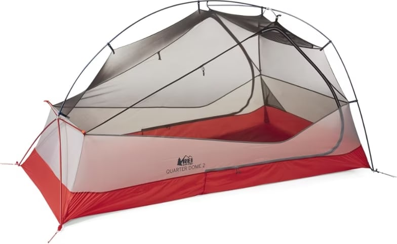
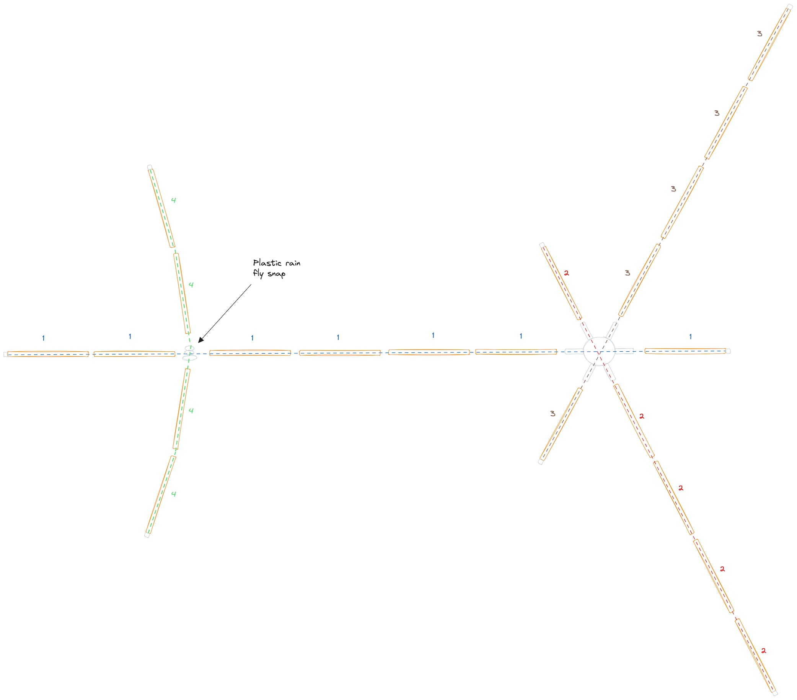

Recently while camping I discovered that the elastic shock cord in my [REI Quarter Dome 2](https://www.rei.com/product/110819/rei-co-op-quarter-dome-2-tent) tent poles had become totally brittle and non-elastic, making it nearly impossible to keep all the poles together. This kind of thing happens when storing the tent in a warm place, or if the cord is wet before storing it for a long time.

The tent pole assembly is a little unusual on the Quarter Dome 2. There is a central hub which routes all the cords to the different poles. I found this a little intimidating to try and repair the cords before making a proper diagram of how it all fits together. I could not find any existing guide online for this tent. I hope this helps anyone else out there who has this tent, but found the cable routing a little crazy. It's really not so bad when it's broken-down into its smaller parts. I have also color-coded how each of the 4 cord routes should run.

## Tent pole assembly diagram for the REI Quarter Dome 2

_Click image to see zoomed-in detail view_

Each terminal end of the poles has a silver knob, which can be **twisted off**. Inside, you can see how the shock cord is tied. Just cut out the old shock cord and replace with a new one. I bought [this 10m cord from Vaude](https://www.vaude.com/de/en/12860-shock-cord-10-m-tent-shock-cord.html#?colour=1444&size=13424), which is slightly thicker and more robust than the original cord, while still fitting nicely.

For a general idea of how to string the shock-cord through the poles, I [recommend this guide from iFixIt](https://www.ifixit.com/Guide/How+do+I+replace+a+brittle+or+broken+shock+cord-/74524). It includes some close-up videos of how to apply the right amount of tension on the cord as well.
